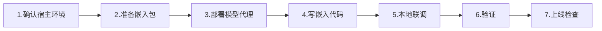

# 🔌 集成指南：把本地智能体嵌入已有 Web 页面

本项目的核心（模型加载 / ReAct 循环 / 工具 / 记忆）与 UI 完全解耦，可以像组件一样嵌入
任意已有页面。提供三种接入方式，按宿主工程的构建能力选择。

---

## 📋 嵌入实操流程（Step by Step，推荐顺序）



### Step 1 · 确认宿主环境（30 秒）
回答三个问题，决定后续步骤：
| 问题 | 分支 |
| --- | --- |
| 宿主页面有无构建工具（Vite/Webpack）？ | 有 → **方式一**（源码）；无 → **方式二**（单文件产物） |
| 宿主站点部署在哪？（Vercel / Netlify / 自建） | 决定 Step 3 的代理配置 |
| 宿主要求零代码接入？ | 是 → **方式三**（iframe），跳到 Step 7 |

### Step 2 · 准备嵌入包
```bash
# 方式一（有构建工具）：在宿主工程里
npm install @missionsquad/browserai
# 然后拷贝本项目 src/ 下 5 个文件：
#   embed.js  agentLoop.js  tools.js  memory.js  modelLoader.js

# 方式二（无构建工具）：在本仓库执行
npm install
npm run build:embed     # 产出 dist-embed/
# 把整个 dist-embed/ 目录上传到宿主站点的同源路径，如 https://你的域名/local-agent/
```

### Step 3 · 部署模型代理（关键！否则模型下载会失败）
模型权重在 HuggingFace（国内无法直连），嵌入页必须能访问**同源**的 `/hf/*`、`/gh-raw/*` 路由。

| 宿主平台 | 操作 |
| --- | --- |
| **Vercel** | 在宿主仓库根目录放 `vercel.json`（内容见本仓库），`rewrites` 把 `/hf/* → hf-mirror.com`、`/gh-raw/* → jsdelivr`。⚠️ 宿主已有 `vercel.json` 时，把 `rewrites` 数组合并进去 |
| **Netlify** | 放 `netlify.toml`，`[[redirects]] status=200 force=true` 透明代理（同上合并） |
| **自建服务器 / Cloudflare Worker** | 部署 `server/dev-proxy.mjs`（Node）或 worker-template，宿主页面配置 `proxyOrigin: "https://代理域名"` |

> 自建代理跨域时：`createLocalAgent({ proxyOrigin: "https://你的代理" })`，代理已内置 CORS 头。

### Step 4 · 写嵌入代码（最小可用模板）
```js
// 方式一（源码）
import { createLocalAgent } from "./embed.js";
// 方式二（产物）—— 见 Step 5 的 HTML 模板

const agent = createLocalAgent({
  onProgress: ({ progress, status }) => {
    bar.style.width = `${Math.round(progress * 100)}%`;   // 渲染进度条
  },
  onReady: () => { sendBtn.disabled = false; },            // 解锁对话
  onError: (err) => { showError(err.message); },           // WebGPU 不支持等
});

await agent.ready();                 // ① 初始化
loadBtn.onclick = () => agent.load();// ② 加载模型
sendBtn.onclick = async () => {
  const { answer } = await agent.chat(input.value, {
    onStep: (s) => { /* action / observation / final 渲染思考过程 */ },
    onDelta: (full) => { /* 流式更新 */ },
  });
  bubble.textContent = answer;       // ③ 渲染最终答案
};
```

### Step 5 · 本地联调（方式二示例：无构建工具页面）
把下面内容保存为 `embed-test.html`，与 `dist-embed/` 放在同一目录，用任意静态服务器打开
（如 `npx serve .` 或 `python -m http.server`），验证 4 行代码能跑通：

```html
<script type="module">
  import { createLocalAgent } from "./dist-embed/local-agent.esm.js";
  const agent = createLocalAgent({
    onProgress: ({ progress }) => console.log("加载进度", Math.round(progress * 100) + "%"),
    onReady: () => console.log("✅ 模型已就绪"),
    onError: (err) => console.error(err),
  });
  await agent.ready();
  await agent.load();               // 首次需下载 447MB，务必先配好 Step 3 的代理
  const { answer } = await agent.chat("现在几点", {});
  console.log("回复:", answer);
</script>
```

### Step 6 · 验证
- 自动化：本仓库 `npm run test:embed`（需先起 proxy 与 dev）验证完整浮窗示例；
- 手动：按 `VERIFICATION.md` 的「Phase 3/4」用例逐条检查（时间、计算、记忆）；
- 网络：浏览器 F12 → Network，确认模型文件经 `/hf/...` 返回 200 且无 CORS 报错。

### Step 7 · 上线检查清单
- [ ] 页面能打开且无控制台报错
- [ ] 「加载模型」进度条 0→100%，二次打开走缓存秒开
- [ ] 对话流式输出正常，思考过程（Action/Observation）可见
- [ ] 首次加载提示已呈现（"约 447MB，请耐心等待"）
- [ ] 不支持 WebGPU 的浏览器有降级提示（`onError` 分支）
- [ ] 已处理与宿主页面的样式冲突（浮窗类名加前缀或 Shadow DOM）

---

## 方式一：npm / 源码方式（推荐，宿主工程有构建工具）

宿主工程是 Vite / Webpack / 其他打包器时，直接以源码复用，体积最小、可定制最强。

```bash
# 在宿主工程中安装依赖
npm install @missionsquad/browserai
```

把以下文件拷入宿主工程（或发布为私有 npm 包后 install）：

```
src/embed.js          ← 嵌入式 API（唯一入口）
src/agentLoop.js      ← ReAct 循环（依赖 ./tools.js）
src/tools.js          ← 工具系统（无第三方依赖）
src/memory.js         ← IndexedDB 记忆
src/modelLoader.js    ← 模型加载引擎（依赖 ./memory 无关，仅 SDK）
```

> `embed.js` 之外的 4 个文件都是**无 DOM 依赖**的纯逻辑模块，可整体移植。

宿主代码：

```js
// 你的页面中
import { createLocalAgent } from "./embed.js";

const agent = createLocalAgent({
  onProgress: ({ progress, status }) => renderProgressBar(progress, status), // 0-1
  onReady: ({ modelId }) => enableChatUI(modelId),
  onError: (err) => showError(err.message),
});

// 页面加载后初始化
await agent.ready();

// 用户点击"加载模型"
await agent.load(); // 默认 Qwen3.5-0.8B，也可 agent.load("gemma3-1b-it-q4f16_1-MLC")

// 用户发送消息
const { answer } = await agent.chat("现在几点", {
  onStep: (step) => {
    // step.type: "stream" | "action" | "observation" | "final" | "error"
    if (step.type === "action") log(`调用工具: ${step.name}`);
  },
  onDelta: (fullText) => renderStreaming(fullText), // 流式输出
});
```

**API 一览**（`createLocalAgent(options)` 返回）：

| 方法 | 说明 |
| --- | --- |
| `ready()` | 初始化（IndexedDB + WebGPU 探测 + 事件订阅 + **启动页面实时内容监听**） |
| `load(modelId?)` | 加载模型（默认 `options.modelId`），进度经回调输出 |
| `chat(text, { onStep, onDelta })` | 对话，自动写入历史；返回 `{ answer, steps, rawTexts }` |
| `isModelLoaded()` / `getLoadedModelId()` | 加载状态查询 |
| `getHistory()` / `clearHistory()` | 对话历史读写（跨轮上下文） |
| `getMemories()` / `saveMemory(k,v)` / `recallMemory(q)` / `clearMemories()` | 长期记忆 |
| `unload()` / `dispose()` | 卸载模型 / 完全销毁（含停止页面监听） |

> 智能体内置 `read_page_content` 工具：可读取**当前嵌入页面**的实时内容（标题/URL/正文，
> MutationObserver 实时缓存）。宿主也可直接 `import { getPageSnapshot } from "./pageReader.js"`
> 自行调用。iframe 跨域场景需宿主用 `postMessage` 推送页面内容。

| 选项 | 默认 | 说明 |
| --- | --- | --- |
| `modelId` | Qwen3.5-0.8B | 默认模型（`getDefaultModelId()`） |
| `modelSource` | `"proxy"` | `"proxy"` 走同源路由下载；`"direct"` 直连 HuggingFace |
| `proxyOrigin` | 页面同源 | 代理服务 origin |
| `verifyProxy` | 本地 true / 托管 false | 是否探测代理健康 |
| `maxSteps` | 5 | ReAct 最大循环步数 |
| `onProgress` / `onStatus` / `onReady` / `onError` | — | 加载事件回调 |

---

## 方式二：单文件产物（宿主页面无构建工具，直接用 <script>）

先用本项目仓库构建出 ESM 单入口（chunk 按需加载）：

```bash
npm install
npm run build:embed        # 产出 dist-embed/
```

把 **整个 `dist-embed/` 目录**部署到宿主站点的同源路径（例如 `/local-agent/`），然后：

```html
<!-- 宿主页面：任意位置加入 -->
<script type="module">
  import { createLocalAgent, getModelOptions } from "/local-agent/local-agent.esm.js";

  const agent = createLocalAgent({
    onReady: () => console.log("模型就绪"),
    onError: (err) => console.error(err),
  });
  await agent.ready();
  // …与方式一相同的调用方式
</script>
```

> - 入口 `local-agent.esm.js` 仅 ~131KB；WebLLM 引擎 chunk（~6MB）在首次 `load()` 时按需下载；
>   Transformers.js 后端 chunk 仅在选用 ONNX 模型时加载。
> - 完整聊天 UI 可参考本仓库 `demo/embed-demo.html`（右下角浮窗示例）。

---

## 方式三：iframe 嵌入（最省事，零代码）

把本项目直接部署为一个独立站点，宿主页面用 iframe 引入：

```html
<iframe src="https://your-agent.example.com/" width="400" height="600"
        style="border:none; border-radius:16px; box-shadow:0 8px 24px rgba(0,0,0,.2)"></iframe>
```

- 优点：无需任何集成代码，独立迭代。
- 缺点：样式与交互与宿主页面隔离；需要把模型代理同时部署在 agent 站点（见下文"模型下载代理"）。

---

## ⚠️ 嵌入前必须处理的三件事

### 1. 模型下载代理（国内网络必需）

模型权重托管在 HuggingFace（国内无法直连）。嵌入页面必须能访问同源 `/hf/*`、`/hf-transformers/*`、
`/gh-raw/*` 路由（`createLocalAgent` 默认 `modelSource: "proxy"` 即请求这些路径）。

| 宿主部署位置 | 方案 |
| --- | --- |
| **Vercel** | 在宿主项目加 `vercel.json`（见本仓库），rewrites 转发 `/hf/* → hf-mirror.com`、`/gh-raw/* → jsdelivr` |
| **Netlify** | 在宿主项目加 `netlify.toml`，200 状态 redirects 透明代理 |
| **Cloudflare Worker / 自建服务器** | 部署 `server/dev-proxy.mjs`（本仓库），并配置 `proxyOrigin` 指向它 |
| **完全离线/内网** | 用 `npx serve` 之类静态托管模型文件，或改造代理指向内网镜像 |

> 若宿主域名与代理不同源，`createLocalAgent({ proxyOrigin: "https://proxy.example.com" })`
> 指向代理；代理需返回 CORS 头（`server/dev-proxy.mjs` 已内置）。

### 2. 浏览器要求：WebGPU

本地 1B 模型推理需要 WebGPU：Chrome / Edge 最新版（开启硬件加速），建议独立显卡。
无 GPU 环境会降级为软件渲染，速度很慢或不可用。宿主代码建议先检测：

```js
const agent = createLocalAgent({ onError: (err) => {
  if (String(err.message).includes("WebGPU")) showBanner("请使用支持 WebGPU 的浏览器");
}});
await agent.ready(); // ready() 内部会探测硬件并通过 onError 报告
```

### 3. 首次加载体验

- 首次 `load()` 需下载约 447MB 权重（Qwen3.5-0.8B），**务必把进度回调渲染出来**；
- 权重缓存在浏览器 IndexedDB / Cache（按域名隔离），二次加载秒级；
- 建议在 UI 上提示"首次加载较慢，之后秒开"。

---

## 附：与宿主页面共存要点

- **样式隔离**：`embed.js` 不注入任何样式；浮窗 UI（`demo/embed-demo.html` 的 `#la-*` 选择器）
  使用带前缀的类名，避免与宿主冲突。也可改用 Shadow DOM 挂载。
- **无全局污染**：不修改 `window`、不拦截事件；仅占用一个 IndexedDB 数据库
  `local-llm-agent`（消息历史 + 记忆）。
- **并发**：`chat()` 有单飞保护（同时只能有一个对话在跑）；`load()` 有单飞保护。
- **销毁**：页面卸载前调用 `agent.dispose()` 释放 WebGPU 上下文与 worker。
