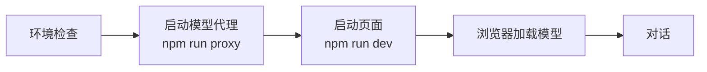
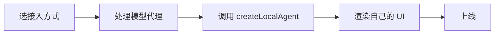
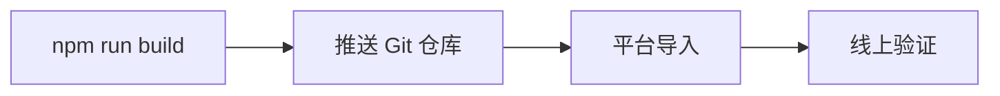

# 📖 使用流程（总览）

本文档串联项目的全部使用路径。详细说明分别见：
[README.md](README.md)（架构/快速开始）· [INTEGRATION.md](INTEGRATION.md)（嵌入指南）。

---

## 场景一：本地体验智能体（最快 1 分钟上手）



### 第 1 步：环境检查
- Node.js ≥ 20（`node -v`）
- 浏览器：Chrome / Edge 最新版，支持 **WebGPU**（`chrome://gpu` 查看）

### 第 2 步：安装依赖（首次）
```bash
npm install
```

### 第 3 步：启动两个终端
```bash
# 终端 1 —— 模型下载代理（国内网络必需，转发到 hf-mirror.com / jsdelivr）
npm run proxy
# 看到: [dev-proxy] listening on http://localhost:8787

# 终端 2 —— 开发服务器
npm run dev
# 看到: VITE ready，打开 http://127.0.0.1:5189
```

### 第 4 步：页面操作
```
打开页面 → 顶部徽章应显示 "WebGPU ✓"
  ↓
左侧选模型（页面初次默认 Qwen3.5 0.8B，ready() 后自动切到推荐档 ⭐ Qwen3.5 2B）→ 点击「加载模型」
  ↓
进度条 0% → 100%（默认档 Qwen3.5 2B 约 1.2GB，3-15 分钟；之后走缓存秒开）
  ↓
绿色提示「模型已就绪」+ 控制台输出 ✅ 模型已就绪
  ↓
开始对话（输入框已解锁）
```

### 第 5 步：验证对话能力（验收用例）
| 输入 | 预期 |
| --- | --- |
| `现在几点` | 思考过程出现 `Action get_current_time`，回复含当前时间 |
| `12*34 等于多少` | 回复 408 |
| `我叫小明` → 再问 `我叫什么名字` | 回答"小明"（跨轮记忆） |
| `记住我的城市是北京` → 新对话 → `我的城市是哪里` | 回答"北京"（长期记忆） |

> 💡 除了主页面（`index.html`），项目还提供两个演示页面：
> - **`search.html`** — 仿百度搜索页，智能体以**右下角悬浮球 + 聊天弹窗**方式嵌入
>   （弹窗宽 600px、高为页面 70%），访问 `http://127.0.0.1:5189/search.html`
> - **`demo/embed-demo.html`** — 模拟已有网站右下角聊天浮窗的嵌入示例

### 第 6 步：收尾
- 新对话：点「🔄 新对话」（清历史，模型保持加载）
- 停止服务：两个终端 `Ctrl+C`

---

## 场景二：嵌入已有 Web 页面



| 步骤 | 说明 |
| --- | --- |
| 1. 选方式 | ① 有构建工具 → npm 源码复用；② 无构建工具 → `npm run build:embed` 单文件；③ 零代码 → iframe |
| 2. 处理代理 | Vercel 加 `vercel.json` / Netlify 加 `netlify.toml` / 自建部署 `server/dev-proxy.mjs`（三者均可在本项目直接复用） |
| 3. 调用 API | `createLocalAgent({ onProgress, onReady, onError })` → `await ready()` → `await load()` → `await chat(text, { onStep, onDelta })` |
| 4. 渲染 UI | 用回调自己画进度条/气泡/流式文本（参考 `demo/embed-demo.html` 浮窗示例） |
| 5. 验证 | `npm run test:embed`（需启动 proxy 与 dev） |

> 完整 API 表与代码示例见 `INTEGRATION.md`。

---

## 场景三：部署上线（Vercel / Netlify）



1. 构建：`npm run build`（产出 `dist/`）
2. 推送到 GitHub/GitLab
3. **Vercel**：导入仓库，自动识别 `vercel.json`（构建命令 + `/hf*` `/gh-raw*` rewrites → 镜像）
   **Netlify**：导入仓库，自动识别 `netlify.toml`（构建命令 + 200 透明代理）
4. 打开线上地址 → 页面自动以 `verifyProxy:false` 运行 → 点「加载模型」经同源路由下载 → 对话
5. 可选：把完整应用（含 UI）部署为独立站点，宿主页面用 iframe 引入

---

## 场景四：测试与验证

```bash
npm test                 # 单元测试（vitest，156 项，无需服务）
npm run test:probe       # 页面探测：加载按钮 / WebGPU / 控制台零报错（无需加载模型）
npm run test:e2e         # 完整 E2E 验收（需 proxy + dev 已启动，Playwright + 系统 Chrome）
npm run test:embed       # 嵌入示例验证（需 proxy + dev 已启动）
npm run test:search      # 智能搜索页（仿百度 + 悬浮球聊天弹窗）验证（需 proxy + dev 已启动）
```

---

## 常用命令速查

| 命令 | 作用 |
| --- | --- |
| `npm run proxy` | 启动模型下载代理（:8787） |
| `npm run dev` | 启动开发服务器（:5189） |
| `npm run build` | 构建应用产物（dist/） |
| `npm run build:embed` | 构建嵌入单文件产物（dist-embed/） |
| `npm test` | 单元测试 |
| `npm run test:coverage` | 单元测试 + 覆盖率报告 |
| `npm run test:probe` | 页面探测：加载按钮 / WebGPU / 控制台零报错 |
| `npm run test:e2e` | 完整 E2E 验收测试 |
| `npm run test:embed` | 嵌入示例验证 |
| `npm run test:search` | 智能搜索页验证 |
| `npm run test:offline` | Service Worker 离线缓存 E2E（Playwright） |

---

## 常见问题

| 问题 | 处理 |
| --- | --- |
| 徽章显示 `WebGPU ✗` | 更新浏览器、开启硬件加速、更新显卡驱动 |
| 进度条长时间不动 | hf-mirror 偶发超时。`dev-proxy` 已内置 **3 次重试**（每次间隔 500ms，总耗时 ≤ 1.5s），无需手动操作；若仍失败，查看代理终端是否有 `dev-proxy upstream error` 日志，再点「重试加载」 |
| 提示 Proxy Worker 未激活 | 确认 `npm run proxy` 已启动、8787 未被占用；首次启动需等几秒（健康检查端点 `/__worker-health`） |
| 端口被占用（5189/8787） | 关闭残留 node 进程后重启：`Get-Process node | Stop-Process`（Windows） |
| 模型答非所问 / 不调工具 | 1B 模型能力有限属预期。可在下拉里直接切到 Qwen3.5 2B 或 4B（不需要改代码）；或在 `src/agentLoop.js` 调高 `MAX_STEPS` 允许多轮试错 |
| 公网部署代理被刷流量 | 设置环境变量 `PROXY_TOKEN=xxx` 开启令牌校验，所有请求必须带 `X-Proxy-Token: xxx` 头或 `?token=xxx` 查询参数（详见 `server/dev-proxy.mjs` 顶部注释） |
| 离线刷新后页面空白 | Service Worker 注册失败（iframe 嵌入 / 非 HTTPS / SW 路径错误）。DevTools → Application → Service Workers 查看注册状态；首次注册后需**刷新一次**才能完全接管请求 |
